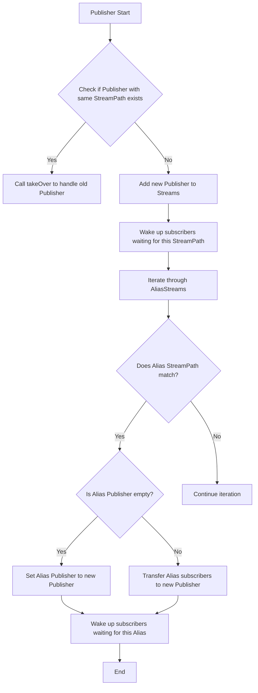
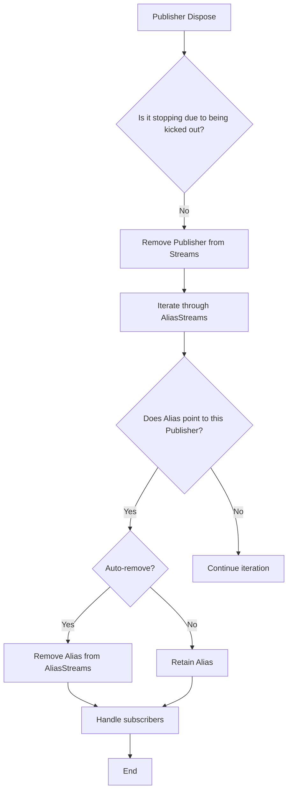
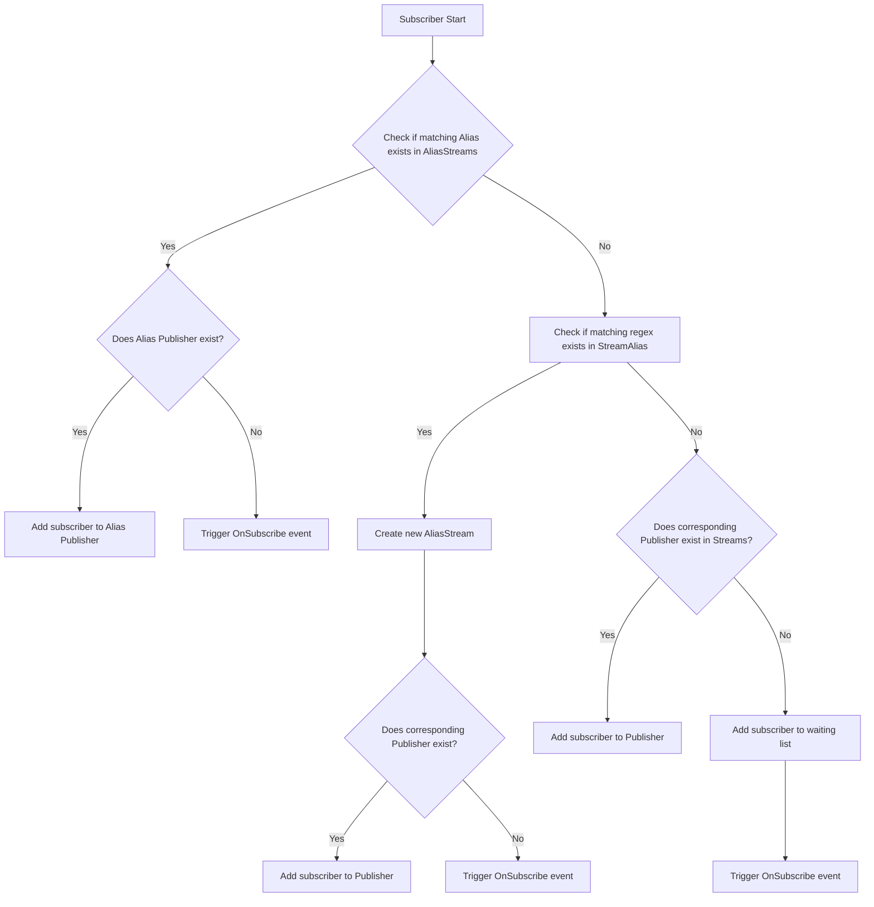
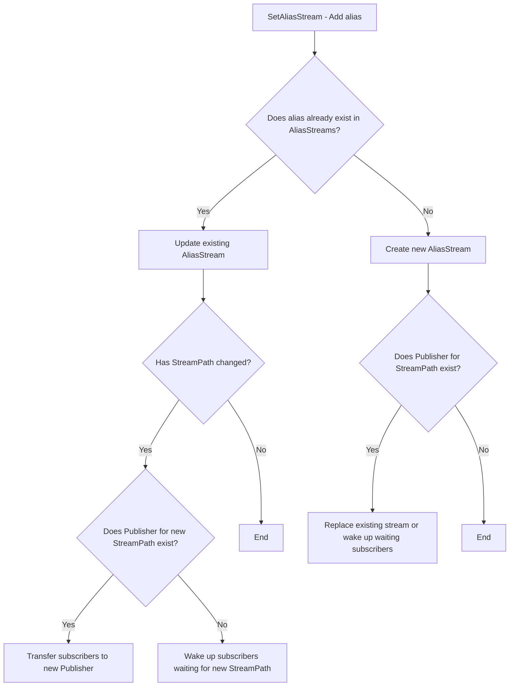
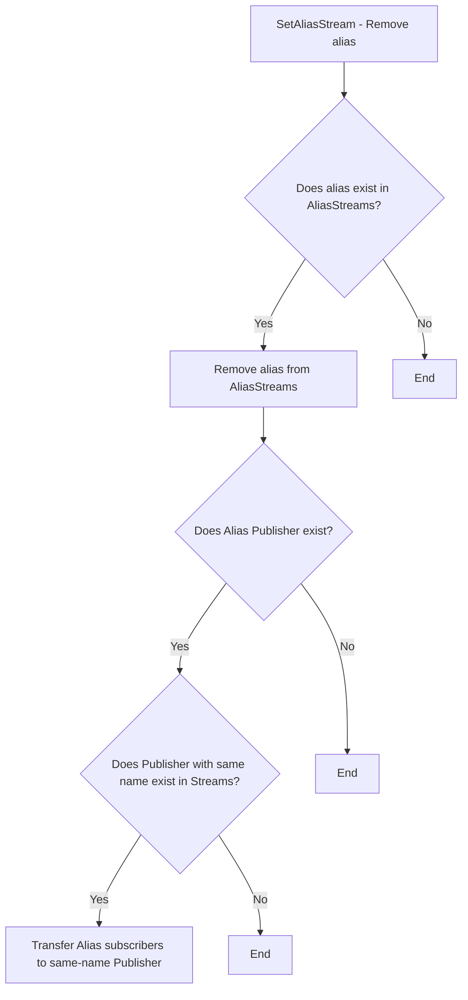

1. Alias handling logic when Publisher Start:



2. Alias handling when Publisher Dispose:



3. Alias handling when Subscriber Start:



4. Logic for adding alias in API SetAliasStream call:



5. Logic for removing alias in API SetAliasStream call:




Based on your requirements, I'll create a flowchart representing the name mapping relationships for the `SetAliasStream` method. I'll use subgraphs to show the structural relationships for different conditions and include the effects on subscribers. Here's the flowchart:

````mermaid
graph TD
    subgraph SetAliasStream
        A[Start] --> B{Is StreamPath provided?}
        B -->|Yes| C[Parse StreamPath]
        B -->|No| D[Remove Alias]
        
        C --> E{Does Publisher exist for StreamPath?}
        E -->|Yes| F[Can Replace = true]
        E -->|No| G[Can Replace = false]
        G --> H[Trigger OnSubscribe]
        
        F --> I{Does Alias exist?}
        G --> I
        I -->|Yes| J[Modify Alias]
        I -->|No| K[Create Alias]
        
        J --> L{Has StreamPath changed?}
        L -->|Yes| M{Can Replace?}
        M -->|Yes| N[Transfer Subscribers or WakeUp]
        M -->|No| O[Update StreamPath]
        L -->|No| P[Update AutoRemove]
        
        K --> Q{Can Replace?}
        Q -->|Yes| R[Transfer Subscribers or WakeUp]
        Q -->|No| S[Add to AliasStreams]
        
        D --> T{Does Alias exist?}
        T -->|Yes| U[Remove from AliasStreams]
        T -->|No| V[End]
        
        U --> W{Does Publisher exist for Alias?}
        W -->|Yes| X[Transfer Subscribers]
        W -->|No| Y[End]
    end
    
    subgraph Effects on Subscribers
        N1[Transfer Subscribers]
        N2[WakeUp waiting Subscribers]
        X1[Transfer Subscribers to matching Publisher]
    end
    
    subgraph Streams and AliasStreams
        S1[Streams: StreamPath -> Publisher]
        S2[AliasStreams: Alias -> StreamPath]
    end
````

This flowchart represents the `SetAliasStream` method's logic, including:

1. Checking if a StreamPath is provided
2. Parsing the StreamPath and checking if a Publisher exists
3. Handling existing or new aliases
4. Updating StreamPath and AutoRemove settings
5. Transferring subscribers or waking up waiting subscribers when applicable
6. Removing aliases and handling potential subscriber transfers

The "Effects on Subscribers" subgraph shows the possible actions that affect subscribers:
- Transferring subscribers to a new Publisher
- Waking up waiting subscribers when a stream becomes available
- Transferring subscribers to a matching Publisher when removing an alias

The "Streams and AliasStreams" subgraph represents the relationship between StreamPaths, Publishers, and Aliases.

This flowchart provides a comprehensive view of the `SetAliasStream` method's logic and its effects on the stream naming and subscriber management.