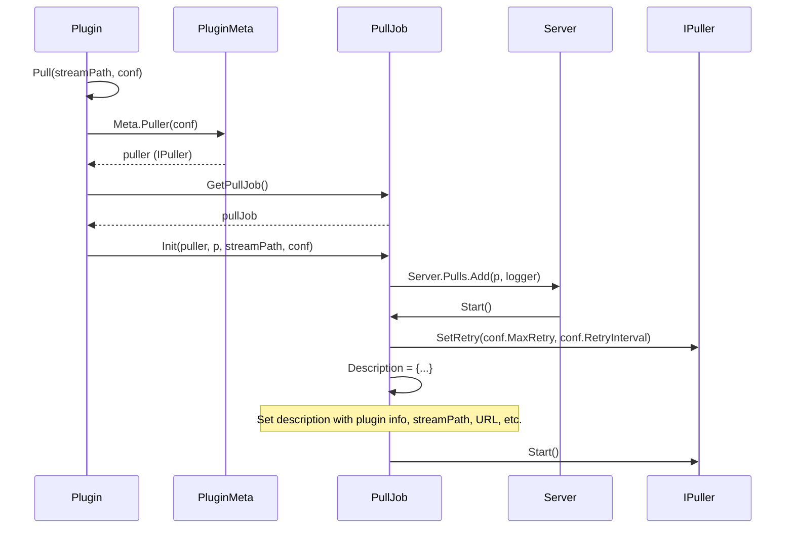

# sequence


# simple config
## flv plugin
### local file
```yaml
flv:
  pull: 
    live/test: /Users/dexter/Movies/jb-demo.flv
```
### remote file
```yaml
flv:
  pull: 
    live/test: http://192.168.1.100/live/stream.flv
```

## mp4 plugin
### local file
```yaml
mp4:
  pull:
    live/test: /Users/dexter/Movies/jb-demo.mp4
```
### remote file
```yaml
mp4:
  pull:
    live/test: http://192.168.1.100/live/stream.mp4
```

## srt plugin
### local file
```yaml
srt:
  pull: 
    live/test: srt://127.0.0.1:6000?streamid=subscribe:/live/stream&passphrase=foobarfoobar
```

## rtmp plugin
```yaml
rtmp:
  pull: 
    live/test: rtmp://127.0.0.1/live/stream
```

## rtsp plugin
```yaml
rtsp:
  pull: 
    live/test: rtsp://127.0.0.1/live/stream
```

## hls plugin
```yaml
hls:
  pull:
    live/test: http://127.0.0.1/live/stream.m3u8
```

## gb28181 plugin
deivceID/channelID
```yaml
gb28181:
  pull: 
    live/test: 34020000002000000001/34020000002000000001
```
# full config
## pull on subscribe
```yaml
xxx:
  onsub:
    pull:
      .*: $0
```

## config retry
```yaml
xxx:
  pull:
    live/test: xxxx
    maxRetry: 3
    retryInterval: 5s
```

## config proxy
```yaml
xxx:
  pull:
    live/test: xxxx
    proxy: http://127.0.0.1:8080
```

## config header
```yaml
xxx:
  pull:
    live/test: xxxx
    header:
      User-Agent: xxx
```

## config args
```yaml
xxx:
  pull:
    live/test: xxxx
    args:
      user: xxx
      password: xxx
```