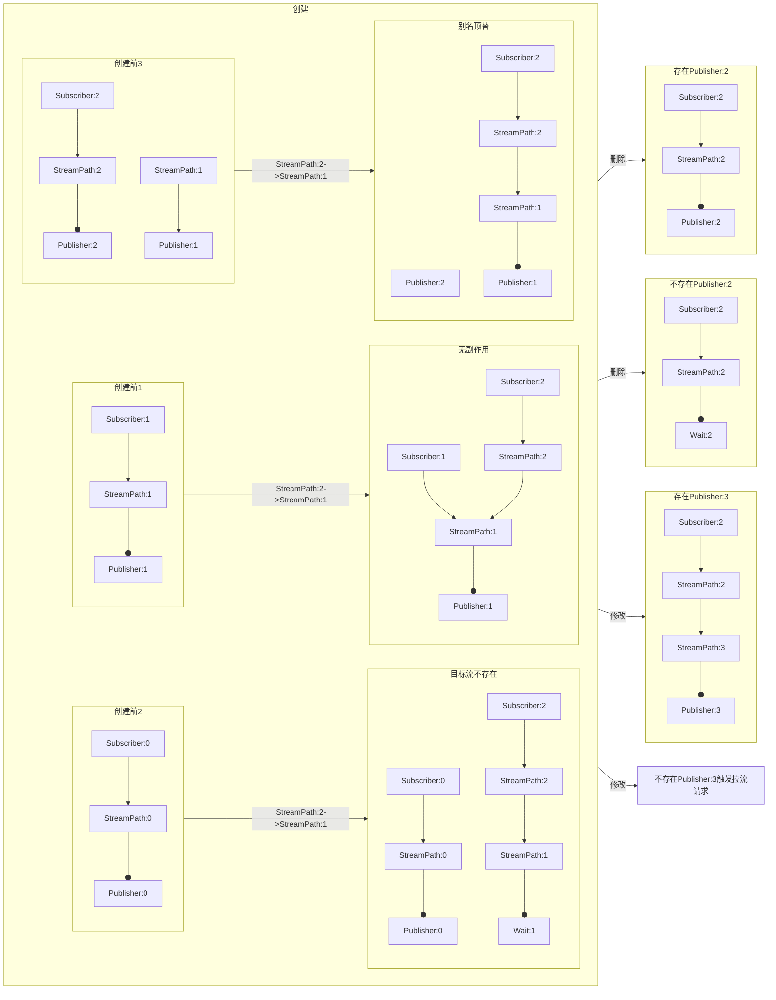
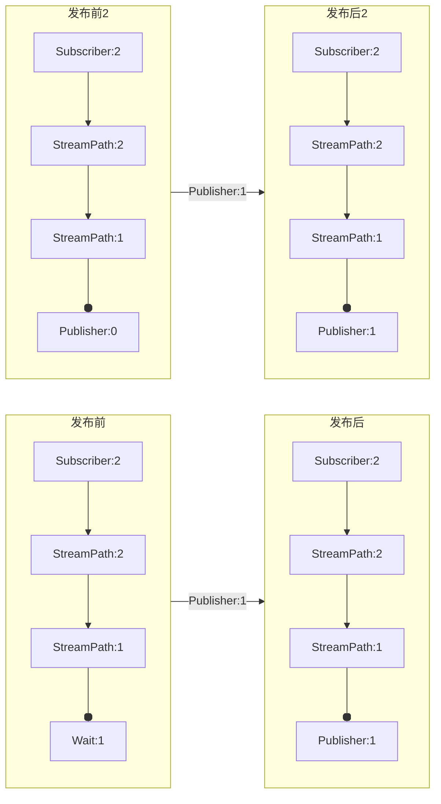
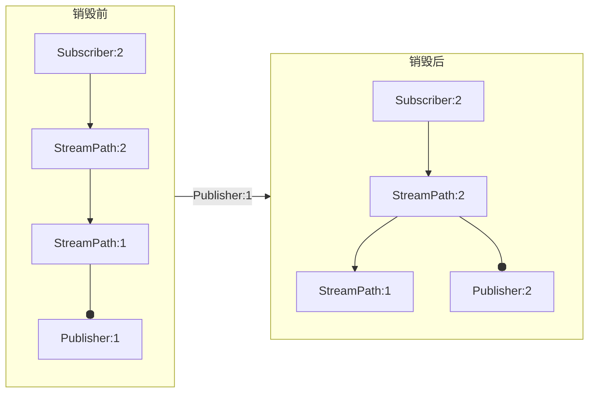
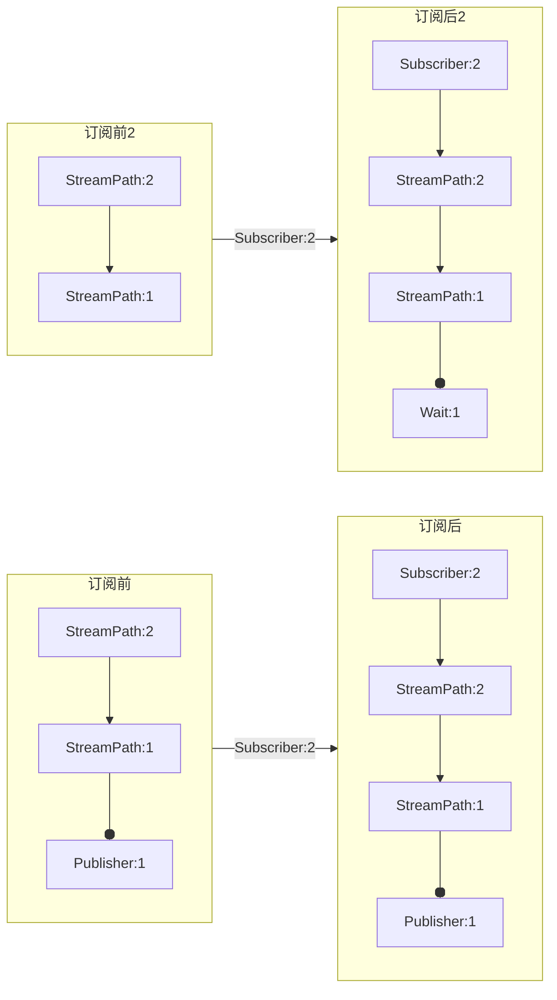
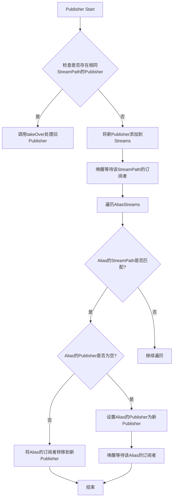
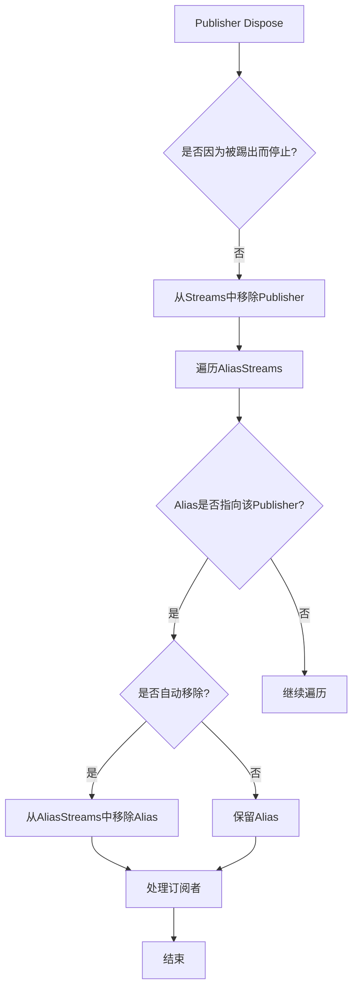
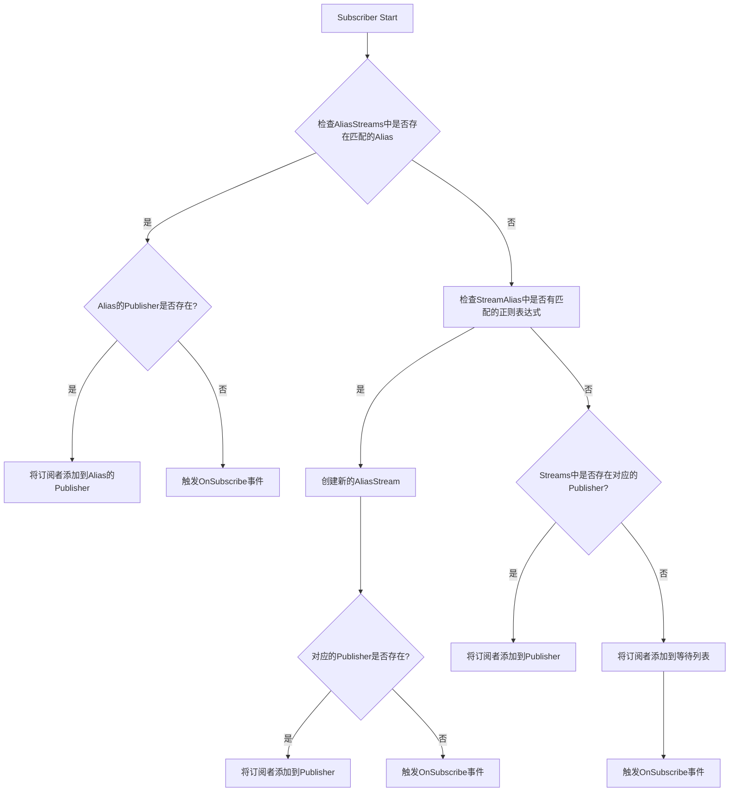
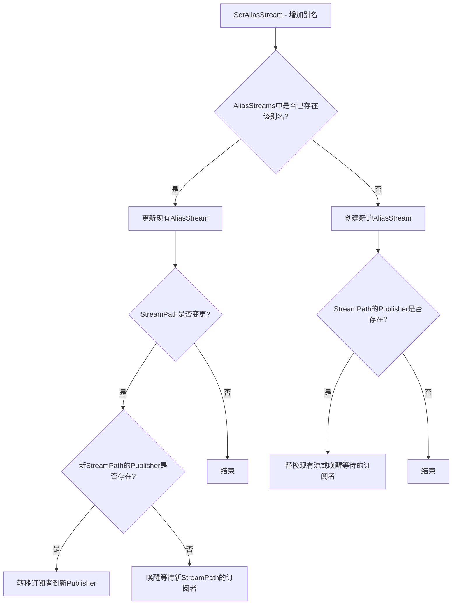
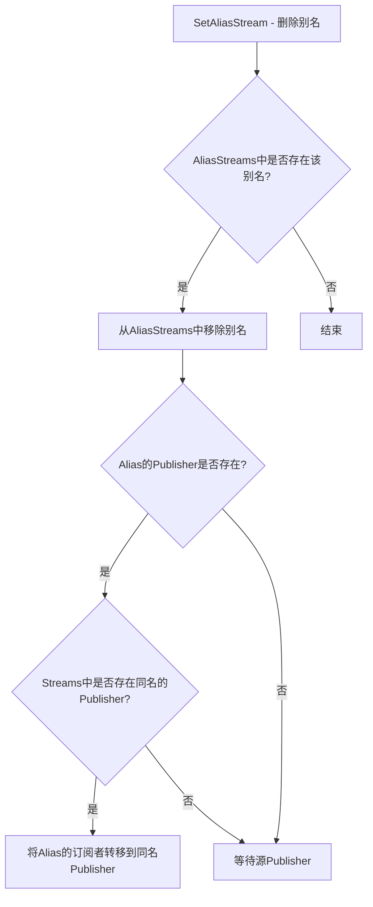

# SetAliasStream 的逻辑

# Publisher Start 时对 Alias 的处理

# Publisher Dispose 时对 Alias 的处理

# Subscriber Start 时对 Alias 的处理

1. Publisher Start 时对 Alias 的处理逻辑：

2. Publisher Dispose 时对 Alias 的处理：

3. Subscriber Start 时对 Alias 的处理：

4. API 中调用 SetAliasStream 增加别名的逻辑：

5. API 中调用 SetAliasStream 删除别名的逻辑：

